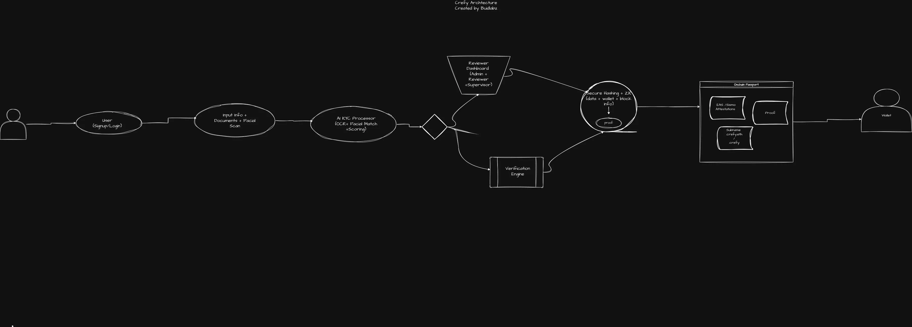

## 📦 Installation


### 1. Clone the Repository

```bash
git clone git@github.com:Cref-y/passport-kyc.git
cd passport-kyc
```

### 2. Install Dependencies

```bash
pnpm install
```

### 3. Start the libp2p Node

```bash
pnpm dev
```


## 🤝 Contributing

Pull requests, issues, and discussions are welcome!  
Let's build the future of decentralized identity together.

---

## 📜 License

AGPL License  
© 2025 Crefy
